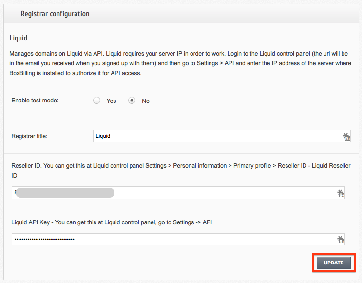

.. _Boxbilling-label:

Boxbilling Integrations
========================

Liquid ResellerCamp Boxbilling Registrar Module Installations
---------------------------------------------------------

1. Get the API key
	a. Login to the ResellerCamp’s reseller control panel (the url will be in the email you received when you signed up) and then go to Settings -> API.
	b. Please note your reseller ID at the bottom of the page.
	c. Click Add API Key button, enter the label and the IP address of the server where Boxbilling is installed to authorize it for API access.
	d. On the same page, note down the API Key.
2. Copy the Boxbilling module files
	a. Download `ResellerCamp’s Boxbilling Registrar Module here <https://github.com/liquidregistrar/liquid-boxbilling/archive/master.zip>`_. 
	b. Extract the zip files to /YourLocalPath/bb-library/Registrar/Adapter
	c. Remember to replace “/YourLocalPath” with the actual location where you installed Boxbilling.
3. Setup Boxbilling Configuration
	a. Now, login to your Boxbilling Administration Area
	b. Go to Configuration and then choose menu Domain Registration
	c. Choose New domain registrar
	d. Choose "Liquid" in the Available Modules. Click Install
	e. Go to menu Registrar. Click Edit with Pencil icon
	f. Enter both the Reseller ID and Liquid API Key noted below
	g. Then click Update

And that's it, Boxbilling will now be able to communicate with your ResellerCamp account to automate domain registration & management for your customers.

Demo Mode
----------
To use the ResellerCamp demo mode or test mode, it's not as simple as ticking the demo mode option in the configuration area. You must setup an account separately on the dedicated resellercamp’s demo system. Read the :ref:`demoaccount-label` documentation.

Next enter your demo account details under Setting > Modules > Liquid. With the Sandbox checkbox ticked you can now place domain registration orders in Boxbilling, the domains will appear on your demo ResellerCamp account but no domain will actually be registered and you will not be charged.

.. note::
	Live nameservers created at the Registry will return a Nameserver is not a valid Nameserver error unless they are created/registered in the demo environment.

	The demo control panel will try to check the validity of the nameservers in the demo platform and not on the Registry, so you must register the nameservers first before attempting any domain registrations on the demo platform.

Feedback
---------

If you find any issues with Resellercamp's Boxbilling registrar module, please use our `ticketing support systems <https://liqudotid.freshdesk.com/support/tickets/new>`_ where we’ll be available and actively listening to all of your feedback.
