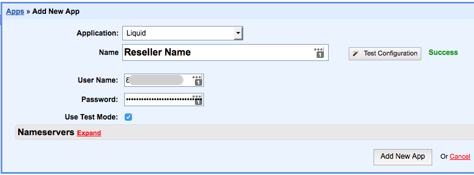

.. _hostbill-label:

HostBill Integrations
========================

Liquid ResellerCamp HostBill Registrar Module Installations
---------------------------------------------------------

1. Get the API key
	a. Login to the ResellerCamp’s reseller control panel (the url will be in the email you received when you signed up) and then go to Settings -> API.
	b. Please note your reseller ID at the bottom of the page.
	c. Click Add API Key button, enter the label and the IP address of the server where HostBill is installed to authorize it for API access.
	d. On the same page, note down the API Key.
2. Copy the HostBill module files
	a. Download `ResellerCamp’s HostBill Registrar Module:
	
		- `For PHP 7.2 <https://www.dropbox.com/s/etbf02937qsc8t1/class.liquid.php.zip?dl=0>`_ (last updated 2020-06-30)
		- `For PHP 5.3 <https://www.dropbox.com/s/8tr48cn8izu497z/resellercamp-hostbill-module.zip?dl=0>`_
	b. Extract the zip files to /YourLocalPath/includes/modules/Domain
	c. Remember to replace “/YourLocalPath” with the actual location where you installed HostBill.
3. Setup HostBill Configuration
	a. Now, login to your HostBill Administration Area
	b. Go to Settings > Modules > Domain Modules
	c. Go to Inactive tab, then choose "Liquid" in the Modules. Click Activate
	d. Then will go to Add New App Menu.
	e. Make sure Application is selected Liquid, then enter Name and both the User Name dan Password with Reseller ID and API Key
	f. Then click Test Configuration, until display the success text at his side
	g. Then click Add New App

And that's it, HostBill will now be able to communicate with your ResellerCamp account to automate domain registration & management for your customers.

Demo Mode
----------
To use the ResellerCamp demo mode or test mode, it's not as simple as ticking the demo mode option in the configuration area. You must setup an account separately on the dedicated resellercamp’s demo system. Read the :ref:`demoaccount-label` documentation.

Next enter your demo account details under Settings > Apps > Name of your Reseller. With the Test Mode checkbox ticked you can now place domain registration orders in HostBill, the domains will appear on your demo ResellerCamp account but no domain will actually be registered and you will not be charged.

.. note::
	Live nameservers created at the Registry will return a Nameserver is not a valid Nameserver error unless they are created/registered in the demo environment.

	The demo control panel will try to check the validity of the nameservers in the demo platform and not on the Registry, so you must register the nameservers first before attempting any domain registrations on the demo platform.

Feedback
---------

If you find any issues with Resellercamp's HostBill registrar module, please use our `ticketing support systems <https://liqudotid.freshdesk.com/support/tickets/new>`_ where we’ll be available and actively listening to all of your feedback.
