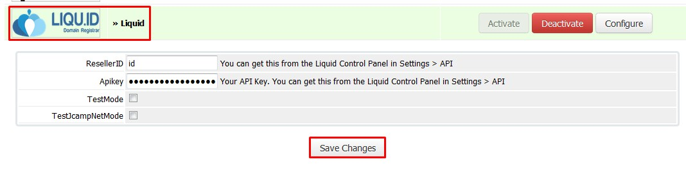
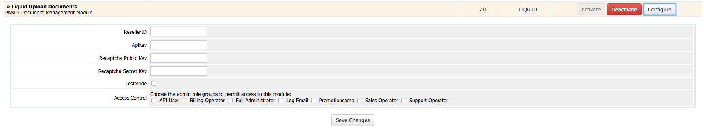
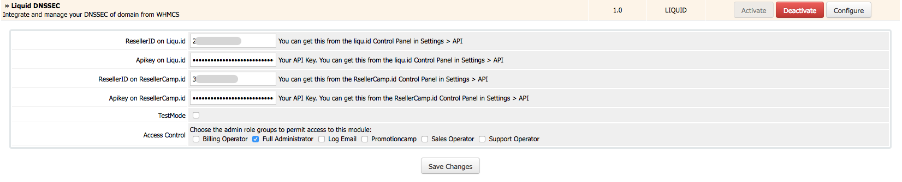
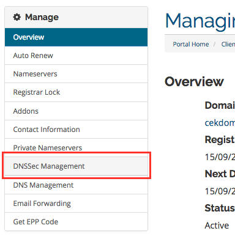

.. _whmcs-label:

WHMCS Integrations
========================

Liquid ResellerCamp WHMCS Registrar Module Installations
---------------------------------------------------------

1. Get the API key
	a. Login to the ResellerCamp’s reseller control panel (the url will be in the email you received when you signed up) and then go to Settings -> API.
	b. Please note your reseller ID at the bottom of the page.
	c. Click Add API Key button, enter the label and the IP address of the server where WHMCS is installed to authorize it for API access.
	d. On the same page, note down the API Key.
2. Copy the whmcs module files
	a. Download ResellerCamp’s WHMCS Registrar Module
	
		- `For PHP 7, Ioncube 10.2  <https://www.dropbox.com/s/uc2ym5jbqzo1ljl/liquid.zip?dl=0>`_ (last update 2018-05-17)
		- `For PHP 7, Ioncube 5.6  <https://s3-ap-southeast-1.amazonaws.com/liqu.id/resellercamp-whmcs-module-ioncube-5.6.zip>`_ (last update 2017-10-05)
		- `For PHP < 7, Ioncube 5.5 <https://s3-ap-southeast-1.amazonaws.com/liqu.id/resellercamp-whmcs-module.zip>`_ (last update 2017-10-05)
	b. Extract the zip files to /YourLocalPath/whmcs/modules/registrars
	c. Remember to replace “/YourLocalPath” with the actual location where you installed WHMCS.
3. Setup WHMCS Configuration
	a. Now, login to your WHMCS Administration Area
	b. Go to Setup > Products/Services > Domain Registrars
	c. Choose "Liquid" in the registrar dropdown menu and enter both the Reseller ID and API Key noted above.
	d. Then click Save Changes

And that's it, WHMCS will now be able to communicate with your ResellerCamp account to automate domain registration & management for your customers.

Demo Mode
----------
To use the ResellerCamp demo mode or test mode, it's not as simple as ticking the demo mode option in the configuration area. You must setup an account separately on the dedicated resellercamp’s demo system. Read the :ref:`demoaccount-label` documentation.

Next enter your demo account details under Setup > Domain Registrars > ResellerCamp. With the Test Mode checkbox ticked you can now place domain registration orders in WHMCS, the domains will appear on your demo ResellerCamp account but no domain will actually be registered and you will not be charged.

.. note::
	Live nameservers created at the Registry will return a Nameserver is not a valid Nameserver error unless they are created/registered in the demo environment.

	The demo control panel will try to check the validity of the nameservers in the demo platform and not on the Registry, so you must register the nameservers first before attempting any domain registrations on the demo platform.

Synchron domain WHMCS with LIQUID
----------------------------------

**Synchron status Transfer in, expired date and status**

This Feature is already included with WHMCS and it’s disabled by default. By enabling this feature, any domain activity such as status, expiry, and transfer status will sync with data in liquid. The following step to enable this feature are : 

-  Setup > General Settings > Domains
	- Checklist domain Sync Enabled
	- Don’t choose Sync Notify Only

- Add cronjob
	0 0 * * * php -q /YourPathWHMCS/crons/domainsync.php that Cronjob will call skrip crons/domainsync.php once a day. each called will have 50 domains to be synced in scrolling, if all domains have been synced then it will start all over again.
	
**Synchron status Transfer out**

LIQUID provide a cron that allows the domain already transferred out to update the status to Expired, the steps :

- Download liquid cron here
	
	- `For PHP 7, Ioncube 10.2 <https://www.dropbox.com/s/zvwwz32ga971ewh/liquid-cron.zip?dl=0>`_ (last update 2018-05-17)
	- `For PHP 7, Ioncube 5.6 <https://s3-ap-southeast-1.amazonaws.com/liqu.id/liquid-cron-ioncube-5.6.zip>`_ (last update 2017-10-17)
	- `For PHP < 7, Ioncube 5.5 <https://s3-ap-southeast-1.amazonaws.com/liqu.id/liquid-cron.zip>`_ (last update 2017-10-17)	

- Move the downloaded liquid folder to /YourPathWHMCS/crons/
- Rename /YourPathWHMCS/crons/liquid/config.sample.php become /YourPathWHMCS/crons/liquid/config.php and then set this part :

	- Database connection
		
	::
	
		$lq_cron_db = array(
			'host'     => 'localhost',
			'username' => 'username',
			'password' => 'password',
			'db'       => 'databaseName',
		);
	
	- Set liqu.id account
	
	::
	
		$lq_cron_registrar = array(
		    'liquid' => array(
			'api_url'     => 'https://api.liqu.id/v1/',
			'reseller_id' => '',
			'api_key'     => '',
		    ),
		    'resellercampid' => array(
			'api_url'     => 'https://api.liqu.id/v1/',
			'reseller_id' => '', // If you have account manage under resellercamp.id
			'api_key'     => '',
		    ),
		);

	- Add Cronjob
	
		0 0 * * * php -q /YourPathWHMCS/crons/liquid/synctransferout.php Once a day call the script crons/liquid/synctransferout.php to chek poll message, if there is a domain transfer out from liqu.id the status will change become expired. You can view log syncron at /YourPathWHMCS/crons/liquid/report/synctransferout-Y-m-d.log.

WHMCS Addon - LIQUID PANDI Document Management Module
-----------------------------------------------------

This module provides tools for registrar / domain resellers who use LIQUID software. This module is used for document management of domain registration requirements in PANDI. The required documents can be uploaded using the WHMCS member area and can be managed by registrar/reseller through the WHMCS admin page. Documents that are already uploaded will be automatically sent through URL api.liqu.id thus making the approval process easier. 

WHMCS Addon Installation for Uploading Documents to Liquid
^^^^^^^^^^^^^^^^^^^^^^^^^^^^^^^^^^^^^^^^^^^^^^^^^^^^^^^^^^

Before you start, please download WHMCS AddOn Module Document Upload below:

- `For PHP 7, Ioncube 10.2 <https://www.dropbox.com/s/ii4l3o63i5juqfi/liquid_upload_document.zip?dl=0>`_
- `For PHP 7, Ioncube 5.6 <https://s3-ap-southeast-1.amazonaws.com/liqu.id/resellercamp-whmcs-upload-document-ioncube-5.6.zip>`_
- `For PHP < 7, Ioncube 5.5 <https://s3-ap-southeast-1.amazonaws.com/liqu.id/resellercamp-whmcs-upload-document.zip>`_

1. Create a new folder and name it documents in whmcs installed. Set the permission folder to 777.
2. Copy the addon files to folder modules/addons. 
3. Login.
4. Go to Setup menu > Addon Modules, then activate addon.

5. Configure addon, enter reseller id, apikey, and google recaptcha key (public & server). How to get a google recaptcha key can be seen `here <whmcs.html#how-to-get-google-recaptcha-key>`_.

6. Modify template to add links to Document Upload page.

.. note::
	Document Upload page can only be accessed in 

	http://domainname.com/index.php?m=liquid_upload_document&domain_id=ID_Domain

	Link directing to the page can also be added in file clientareadomaindetails.tpl in folder templates/{active_template}/

	Example of link code:

	<a href="index.php?m=liquid_upload_document&domain_id={$domainid}" class="btn btn-primary">Upload Document</a>

How to get Google Recaptcha Key
^^^^^^^^^^^^^^^^^^^^^^^^^^^^^^^

1. Go to https://www.google.com/recaptcha/admin#list
2. Create a new sitekey

3. Select a sitekey

4. Take public key and secret key

.. note::
	Since this addon uses a recaptcha service from google, you will need a captcha key you can get after registering in recaptcha. 

WHMCS Addon - LIQUID DNSSec Management Module
---------------------------------------------

This module provides tools for registrars/domain resellers who use LIQUID software. This software is used for DNSSec data management with LIQUID module registrar. To use this module, make sure that you already use LIQUID module registrar on the domain you register. Only domains that are already registered in LIQUID can use this DNSSec module. 

WHMCS Addon Installation for DNSSec Management
^^^^^^^^^^^^^^^^^^^^^^^^^^^^^^^^^^^^^^^^^^^^^^

Before you start, please download WHMCS AddOn Module Liquid DNSSec Management `here for PHP < 7 <https://s3-ap-southeast-1.amazonaws.com/liqu.id/resellercamp-whmcsaddon-liquiddssec.zip>`_ and `here for PHP 7.x.x <https://s3-ap-southeast-1.amazonaws.com/liqu.id/resellercamp-whmcsaddon-liquiddssec-ioncube-5.6.zip>`_

1. Extract the files you just downloaded.
2. Copy folder liquiddnssec from folder modules/addons to folder modules/addons in whmcs user directory.
3. Login as administrator.
4. Go to Setup menu > Addon Modules, and then activate addon. 

5. Configure addon, enter Reseller ID and Apikey

6. After the installation and configuration is done, Liquid DNSSec submenu will appear in Addons menu on the admin page.

7. DNSSec Management submenu will also appear on the sidebar of Manage menu on the client domain details page.

Demo Mode of DNSSec Management
^^^^^^^^^^^^^^^^^^^^^^^^^^^^^^

Enter your demo account details under Setup menu > Addon Modules, in Liquid DNSSec. With the Test Mode checkbox ticked you can now manage your dnssec domain in WHMCS, the dnssec domain will appear on your demo ResellerCamp account but no domain will actually be registered and you will not be charged.

Feedback
---------

If you find any issues with Resellercamp's WHMCS registrar module, please use our `ticketing support systems <https://liqudotid.freshdesk.com/support/tickets/new>`_ where we’ll be available and actively listening to all of your feedback.
